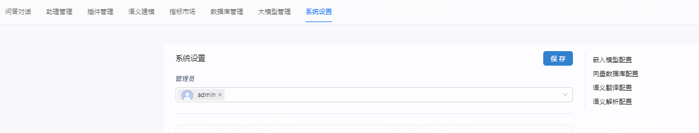
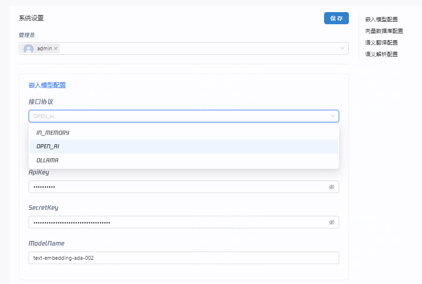

[English](README.md) | [日本語版](README_JP.md) | [文档中心](https://supersonicbi.github.io/)

# SuperSonic

**SuperSonic融合Chat BI（powered by LLM）和Headless BI（powered by 语义层）打造新一代的BI平台**。这种融合确保了Chat BI能够与传统BI一样访问统一化治理的语义数据模型。此外，两种BI新范式都从中获得收益：

- Chat BI的Text2SQL生成通过检索语义数据模型得到增强。
- Headless BI的查询接口通过支持自然语言API得到拓展。

通过SuperSonic的问答对话界面，用户能够使用自然语言查询数据，系统会选择合适的可视化图表呈现结果。SuperSonic不需要修改或复制数据，只需要在物理数据模型之上构建逻辑语义模型（定义指标/维度/实体/标签，以及它们的业务含义、相互关系等），即可开启数据问答体验。与此同时，SuperSonic被设计为可插拔的框架，采用Java SPI机制来扩展定制功能。

## 项目动机

大型语言模型（LLM）如ChatGPT的出现正在重塑信息检索的方式，引领数据分析领域的一种新范式，被称为Chat BI。为了实现Chat BI，学术界和工业界主要关注利用LLM的能力将自然语言转换为SQL，通常称为Text2SQL或NL2SQL。尽管一些方法显示出有希望的结果，但它们在大规模实际应用中的可靠性还不足。

与此同时，另一种新兴范式被称为Headless BI，它专注于构建统一的语义数据模型，并引起了广泛的关注。Headless BI通过一个通用的语义层来实现，通过开放的API公开一致的数据语义。

从我们的角度来看，Chat BI和Headless BI的融合有潜力在两个方面增强Text2SQL的能力：

1. 将数据语义（如业务术语、列值等）纳入提示词中，使LLM能够更好地理解语义，以**减少幻觉**。
2. 将高级SQL语法（如连接、公式等）的生成从LLM卸载到语义层，以**减少复杂度**。

为了验证上述想法，我们开发了SuperSonic项目，并将其应用在实际的内部产品中。与此同时，我们将SuperSonic作为一个可扩展的框架开源，希望能够促进数据问答对话领域的进一步发展。

## 开箱即用的特性

- 内置Chat BI界面以便*业务用户*输入数据查询。
- 内置Headless BI界面以便*分析工程师*构建语义模型。
- 内置基于规则的语义解析器，在特定场景（比如DEMO演示、集成测试）可以提升推理效率。
- 支持文本输入联想、多轮对话、查询后问题推荐等高级特征。
- 支持三级权限控制：数据集级、列级、行级。

## 易于扩展的组件

SuperSonic的整体架构和主流程如下图所示：

- **模型知识库(Knowledge Base)：** 定期从语义模型中提取相关的模式信息，构建词典和索引，以便后续的模式映射。

- **模式映射器(Schema Mapper)：** 将自然语言文本在知识库中进行匹配，为后续的语义解析提供相关信息。

- **语义解析器(Semantic Parser)：** 理解用户查询并抽取语义信息，生成语义查询语句S2SQL。

- **语义修正器(Semantic Corrector)：** 检查语义查询语句的合法性，对不合法的信息做修正和优化处理。

- **语义翻译器(Semantic Translator)：** 将语义查询语句翻译成可在物理数据模型上执行的SQL语句。

- **问答插件(Chat Plugin)：** 通过第三方工具扩展功能。给定所有配置的插件及其功能描述和示例问题，大语言模型将选择最合适的插件。

- **问答记忆(Chat Memory)：** 将历史的查询轨迹进行封装，可被召回作为few-shot样例嵌入提示词。

## 快速体验

### 线上环境体验

访问<http://117.72.46.148:9080> 注册新用户体验. 请勿修改系统配置。我们每周末定期重启重置配置。

### Docker部署

- 安装好Docker以及docker-compose
- 下载docker-compose.yml；执行命令：wget <https://raw.githubusercontent.com/tencentmusic/supersonic/master/docker/docker-compose.yml>
- 执行："docker-compose up -d"
- 在浏览器访问<http://localhost:9080> 开启探索

### 本地构建

SuperSonic自带样例的语义模型和问答对话，只需以下三步即可快速体验：

- 从[release page](https://github.com/tencentmusic/supersonic/releases)下载预先构建好的发行包
- 运行 "assembly/bin/supersonic-daemon.sh start"启动standalone模式的Java服务
- 在浏览器访问<http://localhost:9080> 开启探索

### 开发

启动类StandaloneLauncher，项目基于Spring SPI的机制，通过META-INF/spring.factories配置，实现了解析器、校正器、优化器和执行器的可插拔。

## 如何构建和部署

请参考项目[文档](https://supersonicbi.github.io/docs/%E7%B3%BB%E7%BB%9F%E9%83%A8%E7%BD%B2/%E6%BA%90%E7%A0%81%E7%BC%96%E8%AF%91%E9%83%A8%E7%BD%B2/)。

## 界面

### 系统设置

系统设置包含了嵌入模型配置、向量数据库配置、语义翻译配置、语句解析配置

#### 嵌入模型配置

嵌入模型配置的配置类为：
com.tencent.supersonic.common.config.EmbeddingModelParameterConfig

配置的嵌入模型（Embedding Model）是实现 “根据语义找信息” 的核心基础设施。
它主要被用于以下 4 个关键业务场景（通过调用 EmbeddingService和 ModelProvider）

1. schema 映射与实体识别 (最核心)
业务逻辑：当用户提问（如“看下访问量”）时，系统需要知道“访问量”对应数据库里的哪个指标（如 pv_count）。
代码位置：
MetaEmbeddingService: 负责将所有的元数据（指标名、维度名、别名、描述）向量化存储。
EmbeddingMatchStrategy: 在解析用户问题时，将用户的白话（Query）转为向量，去向量库里搜索最相似的元数据信息。
MetaEmbeddingTask / MetaEmbeddingListener: 负责定时或在元数据变更时自动更新向量索引。
2. Text-to-SQL 的 Few-Shot 样本召回 (Exemplar)
业务逻辑：为了让大模型生成的 SQL 更准确，系统会预存一些优秀的 "问题-SQL" 对作为样本（Exemplar）。当用户提问时，系统会先在这些样本中搜索相似的问题，把对应的正确写法发给大模型做参考。
代码位置：
ExemplarServiceImpl
: 负责样本的存储（
storeExemplar
）和召回（
recallExemplars
）。它会加载 s2-exemplar.json 作为系统预置样本。
3. 下一步指标推荐 (Metric Recommend)
业务逻辑：在对话结束后，系统可能会猜你想问什么关联指标。这可能涉及到计算指标之间的语义相似度。
代码位置：
MetricRecommendProcessor: 使用嵌入向量来分析和推荐相关的业务指标。
4. 插件/工具匹配 (Plugins)
业务逻辑：如果系统挂载了很多插件（功能扩展），当用户指令模糊时，可以通过语义向量匹配最合适的工具来执行。
代码位置：
PluginManager: 涉及插件描述信息的向量化处理。

- 向量数据库配置 EmbeddingStoreParameterConfig
- 语义翻译配置 SemanticTranslatorParameterConfig
- 语句解析配置 SemanticParserParameterConfig

ModelProvider.java

## 项目结构

The system uses Spring SPI extensively (META-INF/spring.factories) for pluggable implementations of parsers, correctors, optimizers, and executors.

### 📊 **核心区别**

| 维度         | **CHAT**                          | **HEADLESS**           |
| :----------- | :-------------------------------- | :--------------------- |
| **应用场景** | 面向最终用户的对话交互            | 面向系统内部的数据建模 |
| **使用模块** | `chat` 模块、`headless/chat` 模块 | `headless/server` 模块 |
| **主要用途** | 自然语言查询、对话处理、结果解释  | 数据模型构建、语义建模 |

🎯CHAT 类型主要用于以下对话处理相关的功能

1. 语义解析

- OnePassSCSqlGenStrategy  通过大模型做语义解析生成 S2SQL
- NL2SQLParser 根据历史对话改写本轮对话

1. SQL 修正和优化

- LLMSqlCorrector - 对解析的 S2SQL 做二次修正
- LLMPhysicalSqlCorrector - 对物理 SQL 做性能优化

1. 用户交互增强

- ErrorMsgRewriteProcessor - 将异常信息改写为更友好的提示用语
- DataInterpretProcessor - 对结果数据做提炼总结
- PlainTextExecutor - 直接将原始输入透传大模型

1. 记忆和上下文

- MemoryReviewTask - 记忆启用评估

🎯 AppModule.HEADLESS 的使用场景
从代码中看到，HEADLESS 类型主要用于系统内部的数据建模：

数据语义建模：
LLMSemanticModeller - 通过大模型来构造数据语义模型
自动分析数据库表结构，生成模型名称、描述
自动识别字段类型（主键、外键、维度、度量等）
为度量字段生成聚合函数（MAX, MIN, AVG, SUM, COUNT）
💡 设计意图
这种分类设计的目的是：

职责分离：将面向用户的对话功能与内部的数据建模功能分开
配置管理：通过 ChatAppManager.getAllApps(AppModule.CHAT) 可以按模块类型获取特定的应用配置
模块化管理：不同模块可以独立配置、启用/禁用各自的 AI 功能

ModelProvider

📝 简单总结
CHAT = 用户可见的对话交互功能（如自然语言查询、结果解释等）
HEADLESS = 用户不可见的后台数据建模功能（如自动构建语义模型）

1.安装项目依赖 在 webapp 根目录执行：
cd d:\git\supersonic\code\webapp
pnpm install

2.编译 Chat SDK (依赖库) 先编译通用的聊天 SDK 组件：
cd packages/chat-sdk
pnpm run build
pnpm link --global

3.编译前端主程序 (Supersonic FE) 链接刚才编译的 SDK 并开始构建主程序：
cd ../supersonic-fe
pnpm link --global supersonic-chat-sdk
pnpm install
pnpm run build:os-local
