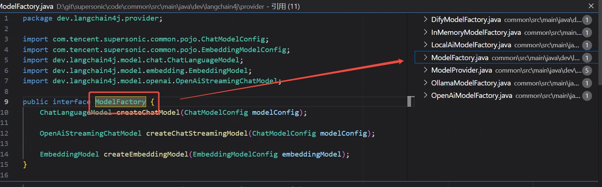

# Common 公共模块

该模块是 SuperSonic 的基础库，封装了跨模块通用的工具类、基础组件和第三方依赖管理。

## 主要功能

* **基础工具**: 字符串处理、日期时间工具、JSON 序列化/反序列化（FastJSON/Jackson）。
* **Web 支持**: 全局异常处理、通用响应结构。
* **LLM 集成**: 集成 LangChain4j，提供与大语言模型（OpenAI, Ollama 等）交互的统一抽象。
* **数据库支持**: MyBatis/MyBatis-Plus 配置、连接池管理、SQL 解析（JSqlParser/Calcite）。
* **其他**: 缓存（Caffeine）、日志（SLF4J）、HTTP 客户端（HttpClient 5）。

## 依赖关系

大多数业务模块（Auth, Chat, Headless）都依赖此模块。

## HanLP

HanLP 是一个开源的自然语言处理工具包，提供了分词、词性标注、命名实体识别等功能。

本项目集成 HanLP 后，采用 **源码覆盖（Source Code Overlay）** 的方式进行了定制化改造。

* **原理**：在 `src/main/java` 中创建与 HanLP 库相同的包路径 (`com.hankcs.hanlp.*`)，并放置同名类文件（如 `CoreDictionary.java`）。根据 Java 类加载机制（或 Maven 构建顺序），项目源码中的类会优先于 JAR 包中的类被加载/编译。
* **目的**：
    1. **定制词典加载逻辑**：覆盖 `CoreDictionary` 等核心类，使其适配 SuperSonic 的动态配置和资源加载机制。
    2. **扩展功能**：添加如 `LoadRemoveService` 等自定义服务，用于实现基于不同语义模型（Model/DataSet）的词性动态过滤功能，这是原生 HanLP 无法直接支持的业务需求。

